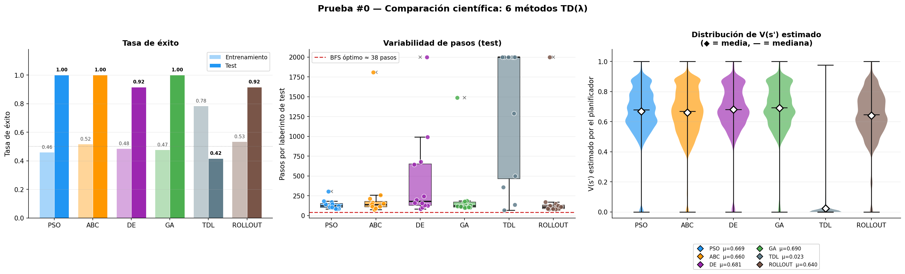
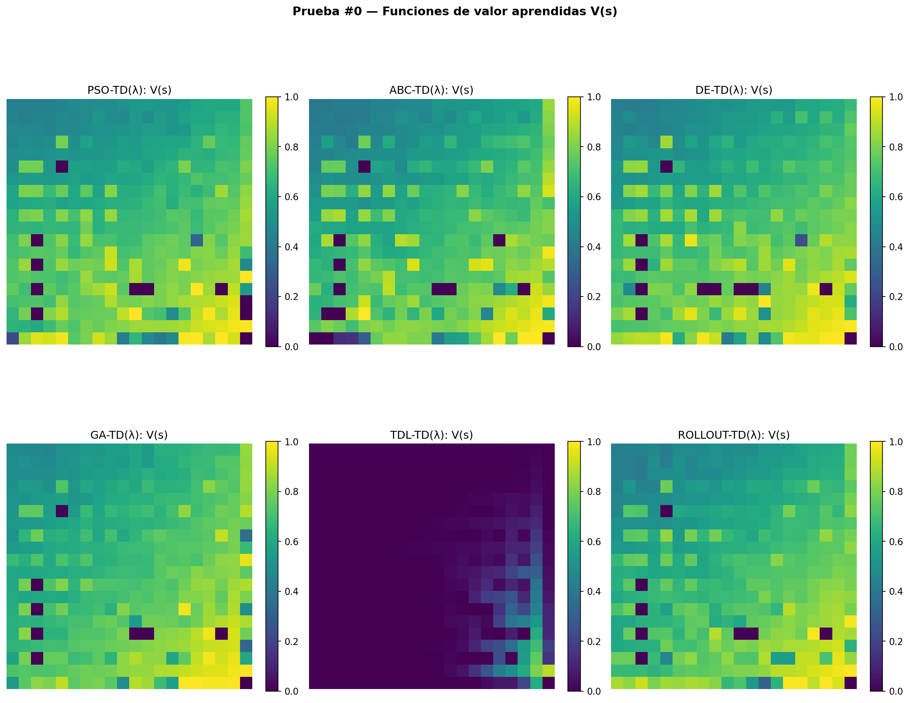
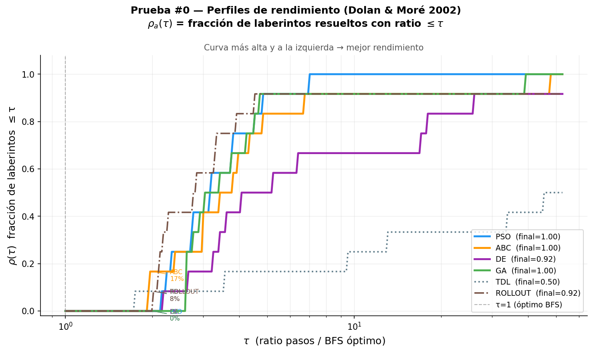

# Bio-Inspired Lookahead Planning in TD(λ) for Sparse-Reward Maze Navigation

Experimental framework comparing **six lookahead planning strategies inside a
temporal-difference TD(λ) reinforcement-learning agent** on sparse-reward
20×20 maze navigation. Four of the planners are bio-inspired metaheuristics
(PSO, ABC, DE, GA); the other two are baselines (a classic TD(λ) greedy
bootstrap and a random-rollout planner).

> M.Sc. research (Robotics & Artificial Intelligence, Universidad de Guadalajara,
> CUCEI). First-author manuscript in preparation for the **IEEE Congress on
> Evolutionary Computation (CEC) 2027**.
> Advisor: Dra. Nancy Arana Daniel (SNI III).

---

## The idea in one paragraph

Standard TD(λ) bootstraps its value target from a single table lookup:
`δ = r + γ·V(s') − V(s)`. This project replaces that one-step lookup with a
**short-horizon lookahead** whose action sequences are optimized by a
population-based metaheuristic, producing a higher-quality bootstrap target
`G_plan(s') = max over N depth-H sequences [ Σ γ^k r_k + γ^H V(s_H) ]`.
The Bellman fixed point `V*` is unchanged; the open question the experiment
measures is whether a **directed** search (PSO/ABC/DE/GA) buys faster or more
robust convergence than an **undirected** one (random rollout) or than no
lookahead at all, under a **fixed evaluation budget** so the comparison is fair.

## Planners compared

| Planner | Type | Bootstrap target | Cost / call |
|---------|------|------------------|-------------|
| **TDL** | Baseline | `V(s')` (greedy table lookup) | O(1) |
| **ROLLOUT** | Baseline | best of N random depth-H rollouts | O(N·H) |
| **PSO** | Bio-inspired | best of N particle-swarm-optimized sequences | O(N·H) |
| **ABC** | Bio-inspired | artificial bee colony | O(N·H) |
| **DE** | Bio-inspired | differential evolution | O(N·H) |
| **GA** | Bio-inspired | genetic algorithm | O(N·H) |

All lookahead planners share the same evaluation budget per planning call
(≈48 evals) so differences reflect *search quality*, not compute spent.

## Repository structure

```
core.py                 Shared TD(λ) train/test loops, sparse eligibility traces,
                        two-phase epsilon schedule, planner interface
maze_env.py             20×20 grid MDP: transitions, reward, BFS optimal-path oracle
TDLambda_clasico.py     TDL   baseline planner
TDLambda_rrollout.py    ROLLOUT baseline planner
TDLambda_pso.py         PSO   planner
TDLambda_abc.py         ABC   planner
TDLambda_de.py          DE    planner
TDLambda_ga.py          GA    planner
run_all.py              Experiment runner: trains all planners, runs the full
                        statistical analysis, writes report + figures
experiment_tracker.py   Run fingerprinting, deduplication and traceability
monitor.py              Live training monitor (separate process)
laberintostrain.csv     24 training mazes
laberintostest.csv      12 held-out test mazes
resultados/             Per-run output: prueba_NNN/ with report + figures
```

## What is engineered here (beyond the algorithms)

- **Transfer across mazes.** A single value table `V` is created once and carried
  across all training mazes, so each maze benefits from earlier learning.
- **Sparse eligibility traces.** Only states with `e > 1e-7` are tracked and
  updated: O(visited) instead of O(all 400 states) per step.
- **Fair-budget design.** Every lookahead planner is capped at the same number of
  environment evaluations per call, which is what makes the comparison meaningful.
- **Reproducibility & traceability.** Fixed seeds; `experiment_tracker.py`
  fingerprints each run to deduplicate configurations; raw data is pickled
  immediately after training so reports and figures can be regenerated with
  `--replot NNN` without retraining.
- **Parallel execution, bit-identical to sequential.** Each (planner × seed) run
  is fully independent and can run in its own process; results match the
  sequential path exactly.
- **Automated statistical analysis.** Non-parametric testing built in:
  Wilcoxon signed-rank (paired, on held-out test mazes), Mann-Whitney U
  (independent, on training effort), Bonferroni correction across all pairwise
  comparisons, and effect-size reporting (`r`).

## Running it

```bash
pip install -r requirements.txt

python run_all.py                 # train all planners in parallel, full analysis
python run_all.py --algos PSO DE  # a subset
python run_all.py --jobs 1        # sequential mode with live monitor
python run_all.py --replot 42     # rebuild report + figures for prueba_042
                                  # from cached raw data, no retraining
```

Each run creates `resultados/prueba_NNN/` containing a technical report
(`informe.txt`) and ~20 figures (convergence curves, value-function heatmaps,
Dolan-Moré performance profiles, TD-error distributions, statistical-test
matrices).

## Example analysis output

The figures below come from one illustrative run of the pipeline. They show the
*kind* of analysis produced, not the final benchmark numbers (the full
multi-seed study is what the CEC 2027 manuscript reports).

| Scientific comparison | Learned value functions |
|---|---|
|  |  |



The recurring qualitative finding: on **held-out test mazes**, planners that
carry a dense, well-propagated value function (the lookahead planners) generalize
far better than a greedy TD(λ) baseline that overfits the training mazes,
even when that baseline looks stronger *during training*. Quantifying that gap
rigorously, with proper multiple-comparison control, is the core contribution.

## Tech stack

Python · NumPy · SciPy (`scipy.stats`) · Matplotlib · `multiprocessing` /
`concurrent.futures`. No deep-learning framework: the point is the
planning-and-bootstrap mechanism, kept transparent on a tabular value function.

## Status

Research code under active development toward the IEEE CEC 2027 submission.
The methodology (fair-budget lookahead, non-parametric analysis) is stable;
the final benchmark is being run across multiple seeds with an exact value-
iteration reference for ground truth.

## Author

**Edgar David Rodríguez Estrada** — Mechatronics Engineer, M.Sc. Robotics & AI.
[github.com/Davidovichi](https://github.com/Davidovichi) ·
[linkedin.com/in/drguez](https://linkedin.com/in/drguez)
